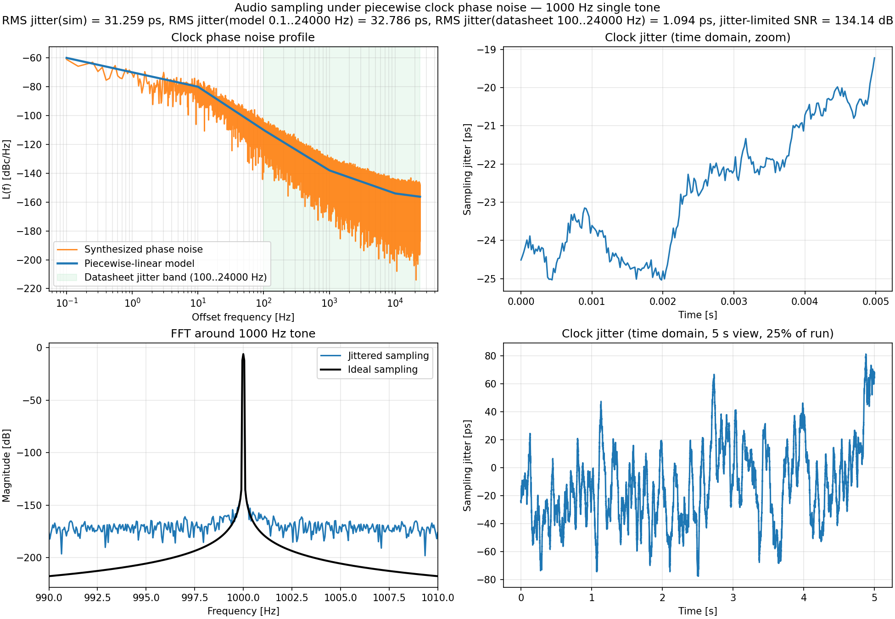

# Clock Audio Jitter Simulator

This project simulates how clock phase noise maps into sampling jitter and degrades audio signal quality.

Main script: `clock_audio_jitter.py`
Default configuration: `clock_audio_jitter_config.yaml`
Output image path: configured by `plots.output_path`

## What It Does

- Builds a phase-noise profile from one of three models:
  - `power_law` (two anchors)
  - `fixed_slope` (specified slope and reference point)
  - `piecewise` (frequency/level anchor list with interpolation)
- Synthesizes phase noise in the frequency domain
- Converts phase noise to timing jitter
- Applies jitter to sample timing for single-tone, 2-tone, or 32-tone comb input
- Computes and reports:
  - simulation RMS jitter
  - model RMS jitter over analysis band (`integration.fmin_hz..integration.fmax_hz`, Nyquist-clipped)
  - model RMS jitter over datasheet band (`integration.datasheet_fmin_hz..integration.datasheet_fmax_hz`, Nyquist-clipped)
  - jitter-limited SNR
- Plots:
  - phase-noise profile (ideal model vs synthesized)
  - shaded datasheet integration band on the phase-noise plot
  - short jitter zoom
  - FFT around the signal or full-band (multitone/comb)
  - zoomed-out jitter trend for low-frequency behavior

## Requirements

- Python 3.10+
- `numpy`
- `matplotlib`
- `pyyaml`

Install:

```bash
pip install numpy matplotlib pyyaml
```

## Run

Default config file in project root:

```bash
python clock_audio_jitter.py
```

Use a custom config:

```bash
python clock_audio_jitter.py --config my_config.yaml
```

Tip: all reported integration upper bounds are effectively clipped to audio Nyquist (`audio.fs_audio_hz / 2`).

## Sample Output

Generic crystal example output:



## Preset Configurations

Ready-to-run examples are in [configs](configs):

- [configs/power_law_single.yaml](configs/power_law_single.yaml): single 1 kHz tone with 2-anchor power-law phase noise
- [configs/piecewise_twotone_19k_20k.yaml](configs/piecewise_twotone_19k_20k.yaml): 19+20 kHz two-tone with piecewise phase-noise profile
- [configs/piecewise_comb_32tone.yaml](configs/piecewise_comb_32tone.yaml): 32-tone comb with piecewise phase-noise profile

Run them directly:

```bash
python clock_audio_jitter.py --config configs/power_law_single.yaml
python clock_audio_jitter.py --config configs/piecewise_twotone_19k_20k.yaml
python clock_audio_jitter.py --config configs/piecewise_comb_32tone.yaml
```

## Configuration Guide

All runtime settings are in `clock_audio_jitter_config.yaml`.

### `audio`

- `fs_audio_hz`: audio sample rate
- `duration_s`: simulation length
- `input_tone_hz`: used in `signal.mode: single`
- `clock_hz`: clock frequency used for phase-to-time conversion
- `rng_seed`: random seed for repeatability

### `signal`

- `mode`: `single`, `twotone`, or `comb`
- `multitone_tones_hz`: tones used for `twotone`
- `comb_tone_count`, `comb_freq_min_hz`, `comb_freq_max_hz`: comb generator controls

### `phase_noise`

- `model`: `power_law`, `fixed_slope`, or `piecewise`

`power_law` fields:
- `f1_hz`, `l1_dbc`, `f2_hz`, `l2_dbc`

`fixed_slope` fields:
- `alpha`: slope exponent in $S_\phi(f)=K/f^\alpha$
- `ref_freq_hz`, `ref_level_dbc`: anchor point
- `use_legacy_flag`: backward-compatibility switch

`piecewise_points`:
- list of `[frequency_hz, level_dbc_per_hz]`
- frequencies must be greater than 0
- at least two points are required
- interpolation is linear in log-frequency and dBc/Hz
- values below the first point or above the last point are endpoint-clamped

### `integration`

- `fmin_hz`, `fmax_hz`: analysis integration band for model RMS jitter
- `datasheet_fmin_hz`, `datasheet_fmax_hz`: separate datasheet-style integration band

Both integration bands are limited by Nyquist (`audio.fs_audio_hz / 2`) in the current implementation.

### `plots`

- `waveform_zoom_periods`: short-time jitter panel zoom
- `jitter_overview_fraction`: long-time jitter panel coverage as fraction of run
- `output_path`: output image path

## Notes

- For low-frequency-dominated phase noise, increase `audio.duration_s` and `plots.jitter_overview_fraction`.
- The phase-noise panel shades the datasheet jitter band with a discrete tint.
- The idealized model trace is drawn in the foreground for readability.
- The summary includes simulation jitter plus both analysis-band and datasheet-band model jitter values.
- In `twotone` mode, the script marks the IMD2 difference product in the FFT panel.
- In `comb` mode, FFT panel shows full audio Nyquist band.
